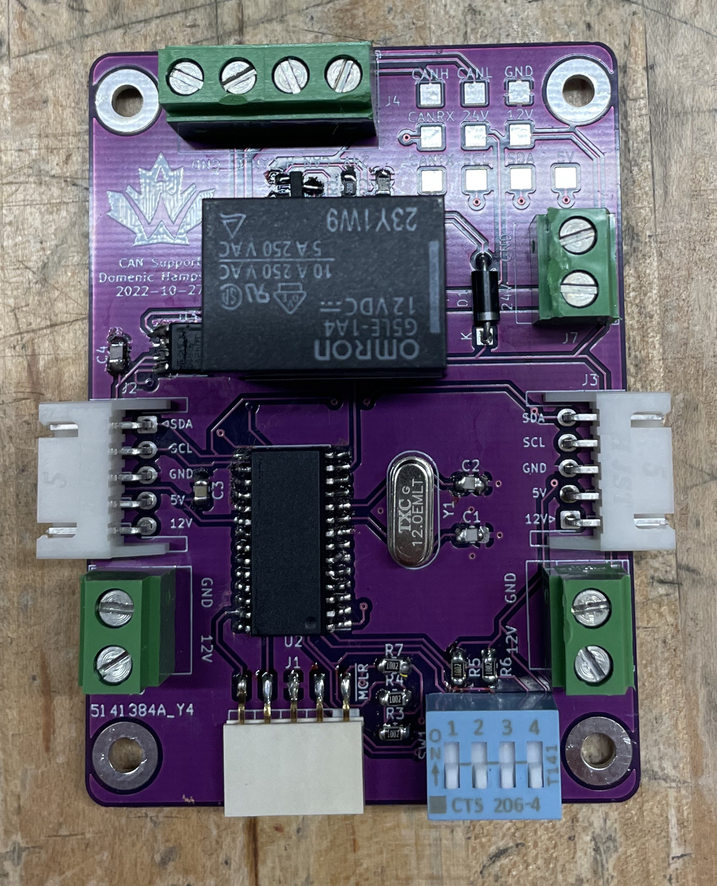

# CAN_Support
<h6>Note: After assembling the board and configuring the PIC MCU and I2C drivers, we realized the functionality could be more easily achieved using another system. For that reason
    the firmware for this board was not completed.</h6>

<h4>CAN Support is a board designed for Waterloo Rocketry, a design team at the Univeristy of Waterloo that launches a student build hybrid rocket to 30,000ft anually!</h3>

<h4>The purpose of this board is to provide a hardwired interface between our rocket's CAN bus and the ground system's I2C bus. This is so that in the case of a live telemetry (radio)
    fail during our launch operation procedures, we can still launch the rocketry via hardwired connection.</h3>

  

<h4>The board uses a PIC MCU with I2C and CAN functionality, decoding incoming CAN signals and converting them into outgoing I2C signals (and vice-versa). The board also controls the
    24V line to the rocket via the relay. The data lines and 24V are connected to the rocket through a magnetic connector that detaches when the rocket launches. </h3>

